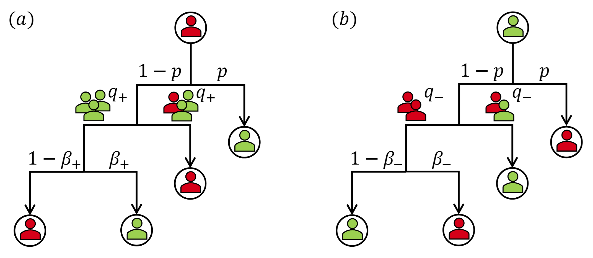

# Decision-Making under Negativity Bias: Double Hysteresis in the Opinion-Dependent q-Voter Model

This repository contains the code used to generate results for the publication *"Decision-Making under Negativity Bias: Double Hysteresis in the Opinion-Dependent q-Voter Model"*.

[Arxiv NOT YET](https://arxiv.org)

## Requirements

The code is written in **Julia** and was tested on **Julia v1.9.2**. To run simulations and analytical calculations, ensure you have the following packages installed:

```julia
using Plots
using LinearAlgebra
using NLsolve
using DifferentialEquations
````

To install missing packages, use:

```julia
using Pkg
Pkg.add(["Plots","LinearAlgebra","DifferentialEquations","NLsolve"])
```

**Optional package:**

* `LaTeXStrings` — only needed for `example_analytical_plot.jl` to render axis labels and titles in LaTeX for better plot aesthetics. If you do not require LaTeX labels, this package can be skipped.

```julia
Pkg.add("LaTeXStrings")  # optional, only for LaTeX-formatted plot labels
```

**Note:** The `DataFrames`,`DelimitedFiles` and `CSV` packages are not required to run the code unless you wish to save data to CSV files. The relevant code for saving data is marked with `# save data to csv file` and is commented out by default.

## Parameters

- **N**  - Number of agents
- **$p$** - Probability of independence
- **$q_+$**  - The group size required for a shift from negative to positive
- **$q_-$**  - The group size required for a shift from positive to negative
- **$\beta_{+}$**  - Probability that a negative agent conforms and changes to a positive opinion.
- **$\beta_{-}$**  - Probability that a positive agent conforms and changes to a negative opinion.


## Model Description

The model is implemented on a complete graph, meaning that the network structure is not explicitly stored. Instead, only the number of adopted agents (**N_up**) is tracked.

### Figure

A schematic diagram of the model parameters (**$p$**,**$q_{+}$**,**$q_{-}$**,**$\beta_{+}$**,**$\beta_{-}$**):



**Caption:**
Illustration of the extended model, where red denotes negative opinions, green positive opinions, and target agents are shown in circles: (a) A negative agent may, with probability **$p$**, act independently and switch to positive, or, with probability **$1-p$**, be influenced by the **$q$**-panel, but only if it is unanimous; otherwise, it retains its state. When exposed to a unanimous positive **$q$**-panel, a negative agent conforms with probability **$\beta_+$** and resists with the complementary probability. (b) The process is analogous for a positive agent, but the influence group sizes in (a) and (b) differ: **$q_+$** is the group size required for a shift from negative to positive, and **$q_-$** the size required for the reverse. For the baseline model **$\beta_+=\beta_-=1$**.

---

## Files and Functions

### Simulation


#### `trajectory_simulation.jl` [View code](trajectory_simulation.jl)
Generates time trajectories for given **$p$**, **$q_{+}$**, **$q_{-}$**, **$\beta_{+}$**, **$\beta_{-}$**  values. Modified for multiple initial conditions.

#### `stable_simulation.jl` [View code](stable_simulation.jl)
Performs Monte Carlo simulations of the system to compute stationary concentrations of positive opinion $c$ for different probabilities $p$, and overlays analytical curves for comparison.

### Analytical

#### `function_plot_analitical.jl` [View code](function_plot_analitical.jl)
Generates analytical curves of positive opinion concentration $c$ as a function of independent behavior probability $p$ for given $q_{+}$, $q_{-}$, $\beta_{+}$, $\beta_{-}$ values. Stable and unstable segments are highlighted, and critical points are optionally marked.

#### `example_analytical_plot.jl` [View code](example_analytical_plot.jl)
Generates example analytical curves of positive opinion concentration $c$ versus independent behavior probability $p$ for given $q_{+}$, $q_{-}$, $\beta_{+}$, $\beta_{-}$ values. Highlights stable and unstable segments with color coding, and includes dummy lines in the legend to indicate different parameter regimes.

---

## How to Run the Code

1. Clone the repository:
   ```sh
   git clone https://github.com/TheMik1999/Negativity_Bias.git
   cd Modeling-biases-in-the-generalized-nonlinear-q-voter-model
   ```
2. Ensure you have **Julia v1.9.2** installed.
3. Install dependencies (if not installed already):
   ```julia
   using Pkg
   Pkg.add(["LinearAlgebra", "Plots", "DifferentialEquations", "NLsolve","LaTeXStrings"])
   ```
4. Run simulations:
   ```julia
   include("trajectory_simulation.jl")
   ```


---

## License

This project is licensed under the MIT License.

## Acknowledgments

This research was partially funded by the National Science Centre, Poland, Grant 2019/35/B/HS6/02530.

## Author

- **TheMik1999** - [GitHub Profile](https://github.com/TheMik1999)


For questions or contributions, feel free to open an issue or submit a pull request!
```

